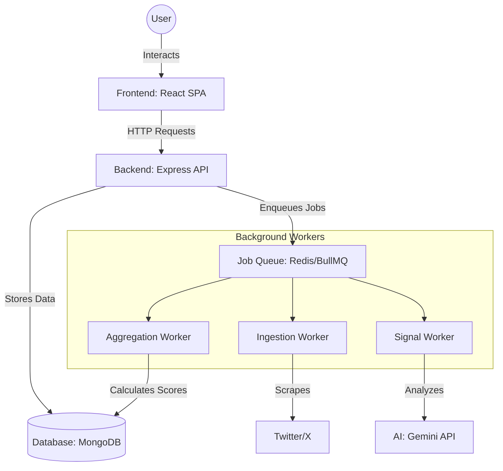

# Foresight: Creator Affiliation & Credibility Analyzer


**Foresight** is a powerful MERN-stack platform that analyzes public creator content (starting with Twitter/X) to extract affiliation signals and credibility indicators. Using advanced AI (Gemini), it aggregates these signals over time to provide explainable trust insights.

> **Note**: The system does not decide who is trustworthy. It reveals patterns so users can decide for themselves.

---

## 🚀 Live Demo
[**View the Live Demo on GitHub Pages**](https://AmeerHamzaKhan97.github.io/foresight/)
*(Note: The demo uses mock data to showcase the UI and analysis patterns.)*

### 🔍 Try searching for:
- **Amitabh Bachchan** (`SrBachchan`)
- **Arun Maini** (`mrwhosetheboss`)
- **Bill Gates** (`BillGates`)
- **Jr NTR** (`tarak9999`)
- **Veritasium** (`veritasium`)

---

## ✨ Key Features

- **🔍 Creator Discovery**: Search for creators by handle or add new profiles via URL.
- **🤖 AI Signal Extraction**: stateless, schema-driven analysis of posts for:
    - **Affiliations**: Brands, ideologies, and alignment strength.
    - **Credibility**: Evidence ratio, consistency, and incentive risks.
- **📊 Explainable Scoring**: Every score is traceable to specific posts and AI reasoning.
- **📈 Timeline Insights**: Track how a creator's alignment or credibility shifts over time.
- **⚡ Async Ingestion**: Robust background worker system (BullMQ) for fetching and processing data.

---

---

## 🏗️ Project Architecture

This section provides a deep dive into how **Foresight** is built. It's designed to help you understand the system from a high level down to the individual components.

### 1. High-Level System Architecture
Foresight follows a **decoupled architecture**, meaning the frontend and backend are separate services that communicate via an API. We use a **background worker pattern** to handle heavy tasks like scraping and AI analysis without slowing down the user experience.



- **Frontend**: A modern React application that provides the user interface.
- **Backend**: A Node.js/Express server that serves as the "brain," handling API requests and managing background jobs.
- **Database**: MongoDB stores creator profiles, fetched content, and AI-generated signals.
- **Queue**: Redis and BullMQ manage "delayed" tasks. For example, when you add a creator, the API doesn't make you wait; it tells a worker to handle it in the background.

---

### 2. Frontend Architecture
The frontend is built for speed and a smooth user experience.

- **Framework**: **React 18** (via Vite) for a component-based UI.
- **State Management**: Uses **React Hooks** (`useState`, `useEffect`) for simple state and **Axios Interceptors** for global API handling (including mock data for the demo).
- **Routing**: **React Router** manages navigation between the Home, search, and profile pages.
- **Styling**: **Tailwind CSS** for a modern, responsive design that looks great on all devices.
- **Visualizations**: **Recharts** transforms complex AI data into easy-to-read charts.

**Real-world Example**: When you type in the search bar, the UI immediately filters results or shows a loading state, keeping the app feeling "snappy."

---

### 3. Backend Architecture
The backend is designed using a **Service-Oriented** approach.

- **Controllers (Routes)**: These handle incoming requests, validate the data, and send back responses.
- **Services**: Contain the "business logic."
    - `TwitterService`: Handles the complex logic of scraping data.
    - `ScoreService`: Contains the mathematical formulas to calculate trust scores.
- **Workers**: Autonomous "employees" that sit in the background and process tasks from the queue. This ensures that even if 100 people add creators at once, the server won't crash.

---

### 4. Database Design
We use **MongoDB** because its flexible "document" structure is perfect for storing varying AI responses and tweet data.

| Collection | Description | Key Fields |
| :--- | :--- | :--- |
| **Creators** | Profiles of people being analyzed | `handle`, `affiliationScore`, `credibilityScore` |
| **Content** | Stored tweets/posts | `text`, `platformId`, `analyzed` (boolean) |
| **Signals** | AI insights extracted from content | `type` (Affiliation/Credibility), `reasoning`, `confidence` |

---

### 5. Data Flow (The Journey of a Request)
1. **Request**: A user enters `@SrBachchan` and clicks "Add."
2. **API**: The server creates a "PENDING" profile and adds a job to the **Queue**.
3. **Ingestion Worker**: Wakes up, scrapes Twitter for the latest 20 tweets, and saves them to the **Database**.
4. **Signal Worker**: Takes those tweets, sends them to **Gemini AI**, and asks: "Is this persona biased?"
5. **Aggregation Worker**: Takes the AI's "Signals" and runs them through our formula to give a final score out of 100.
6. **Response**: The user refreshes the page and sees a beautiful report with scores and charts.

---

### 6. Authentication & Authorization
*Currently in MVP*: The platform is **public**. This means anyone can search and view profiles.
*Future Growth*: We plan to add **JWT (JSON Web Tokens)** for specialized features, allowing users to "save" their favorite creators to a personal dashboard.

---

### 7. Error Handling & Logging
- **The "Safety Net"**: The backend uses a global error-handling middleware. If anything breaks, it logs the error and sends a polite "Internal Server Error" instead of crashing.
- **Toast Notifications**: On the frontend, if an API call fails, a small "Toast" notification (red bubble) pops up to tell the user what went wrong.
- **Job Retries**: If a worker fails (e.g., Twitter is down), BullMQ automatically retries the job later.

---

### 8. Scalability & Performance
- **Asynchronous Processing**: By moving heavy work (AI/Scraping) to background workers, the main API stays fast and responsive.
- **Indexing**: We use MongoDB indexes on `handle` and `platformId` so that searching through thousands of creators happens in milliseconds.
- **Mock Mode**: To save on API costs and server load, the demo version uses pre-written data.

---

### 9. Security Best Practices
- **Environment Variables**: Sensitive keys (like `GEMINI_API_KEY`) are NEVER stored in the code. We use `.env` files.
- **Helmet.js**: Adds security headers to our API to prevent common web attacks.
- **CORS**: Restricts which websites can talk to our API.

---

### 10. Deployment Architecture
- **Continuous Integration (CI)**: We use GitHub Actions to automatically run tests every time code is pushed.
- **Frontend Hosting**: Deployed to **GitHub Pages** for the demo.
- **Backend Hosting**: Designed to run on **Render** or **Railway**, which easily handle Node.js and MongoDB connections.

---

## ⚙️ Getting Started

### 1. Push Code to GitHub

If you haven't already, link this project to your GitHub repository:

```ps1
# Add your remote repository (Replace with your actual URL)
git remote add origin https://github.com/YOUR_USERNAME/YOUR_REPO_NAME.git

# Push the code
git branch -M master
git push -u origin master
```

### 2. Local Setup

1. **Install dependencies**:
   ```ps1
   npm install
   ```

2. **Environment Setup**:
   Create a `.env` file in the root and add:
   ```env
   MONGODB_URI=your_mongodb_uri
   REDIS_URL=redis://localhost:6379
   GEMINI_API_KEY=your_gemini_key
   ```

3. **Running the Application**:
   ```ps1
   npm run dev
   ```

---

## 🚀 Live Demo (GitHub Pages)

The project is configured to automatically use **mock data** when hosted on GitHub Pages (detected via `github.io` hostname).

### How to Deploy:

1. **Install deployment tool**:
   ```ps1
   cd client
   npm install
   ```

2. **Deploy the frontend**:
   ```ps1
   npm run deploy
   ```
   *This will build the React app and push it to the `gh-pages` branch.*

3. **Update Demo Link**:
   Once deployed, replace `YOUR_GITHUB_PAGES_URL_HERE` at the top of this file with your actual URL (usually `https://YOUR_USERNAME.github.io/YOUR_REPO_NAME/`).

---

## 📜 License

This project is licensed under the **ISC License**.
